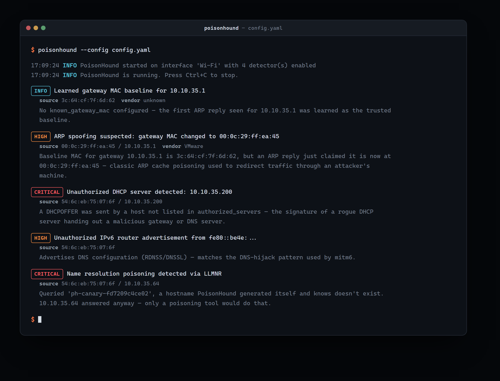

# PoisonHound

[](https://github.com/sergenbiltekin/poisonhound/actions/workflows/ci.yaml)
[](https://github.com/sergenbiltekin/poisonhound/releases)
[](LICENSE)
[](pyproject.toml)

PoisonHound watches a local network for the traffic patterns behind common
man-in-the-middle setups and emails you when it sees one, with enough detail
in the alert to act on it immediately.



*Captured from a real test session: `arpspoof`, a hand-crafted rogue DHCPOFFER, `mitm6`, and `Responder` run against a live PoisonHound instance - not simulated output. IP addresses have been redacted to generic examples.*

It detects:

- **ARP spoofing** - the MAC address claiming to be your gateway changes.
- **Rogue DHCP servers** - a DHCP server not on your whitelist starts
  answering requests.
- **IPv6 router/DHCPv6 hijacking (mitm6-style)** - an unauthorized router
  advertisement or DHCPv6 server tries to push itself as the network's IPv6
  configuration or DNS server.
- **LLMNR / NBT-NS / mDNS poisoning** (Responder, Inveigh, ...) - by
  actively querying hostnames it knows don't exist and alerting on any
  answer, since nothing legitimate could ever resolve them.

## Why the alerts are actually useful

Every alert includes:

- **What was detected and how** - the specific heuristic that fired.
- **Where it came from** - source MAC/IP and a best-effort vendor lookup.
- **What to do about it** - a fixed set of concrete remediation steps for
  that attack type.
- **Proof** - the full packet dump backing the alert is written to the log,
  referenced by the alert's dedup key.

Repeated alerts for the same underlying issue are deduplicated over a
configurable window instead of flooding your inbox.

ARP itself never carries the attacker's real IP - forging that claim is the
whole mechanism behind ARP spoofing. PoisonHound cross-references the
spoofing MAC address against every other protocol it observes (DHCP,
LLMNR/mDNS/NBT-NS, IPv6), so an ARP spoofing alert can often still tell you
"this MAC was last seen using IP X" even though the ARP packet alone can't.

## Installation

Requires Python 3.10+ and, since packet capture needs raw sockets:

- **Linux**: run as root (or grant the interpreter `CAP_NET_RAW`/
  `CAP_NET_ADMIN`), and make sure `libpcap` is installed.
- **Windows**: install [Npcap](https://npcap.com/#download) (check "WinPcap
  API-compatible mode" during setup) and run from an elevated prompt.

```bash
git clone https://github.com/sergenbiltekin/poisonhound.git
cd poisonhound
pip install -e .
```

Or install a tagged release directly, without cloning - grab the `.whl` from
[Releases](https://github.com/sergenbiltekin/poisonhound/releases) and:

```bash
pip install poisonhound-X.Y.Z-py3-none-any.whl
```

Works the same way on Windows and Linux; the release also includes a
`.tar.gz` sdist and a `checksums.txt`.

## Configuration

Copy the example config and edit it for your network:

```bash
cp config.example.yaml config.yaml
```

Key fields:

| Field | Purpose |
|---|---|
| `interface` | Network interface to listen on (e.g. `eth0`, `Ethernet`). |
| `detectors.arp_spoof.gateway_ip` / `known_gateway_mac` | Your gateway's IP and (optionally) its real MAC; leave the MAC unset to auto-learn it on first run. |
| `detectors.rogue_dhcp.authorized_servers` | IPs/MACs of your legitimate DHCP server(s). |
| `detectors.ipv6_rogue_ra.authorized_routers` / `authorized_dhcpv6_servers` | Link-local addresses of your legitimate IPv6 routers/DHCPv6 servers. |
| `detectors.name_resolution_canary` | Tuning for the active LLMNR/mDNS/NBT-NS canary queries. |
| `smtp` | Mail server and recipients for alert emails. |
| `dashboard` | Optional local web UI - see below. Disabled by default. |

SMTP credentials don't have to live in `config.yaml` - copy `.env.example`
to `.env` and set `PH_SMTP__PASSWORD` instead.

## Usage

```bash
poisonhound --config config.yaml
```

Or, without installing the console script:

```bash
python -m poisonhound --config config.yaml
```

Validate a config file without starting the sniffer:

```bash
poisonhound --config config.yaml --check-config
```

Stop with Ctrl+C (SIGINT/SIGTERM are handled gracefully on both Linux and
Windows).

## Web dashboard

Set `dashboard.enabled: true` in `config.yaml` to get a local web UI at
`http://127.0.0.1:8787` (bound to localhost only, by design) with:

- An alert history view, backed by SQLite (`dashboard.db_path`), filterable
  by severity, with full evidence/remediation on each alert's detail page.
- A settings page for SMTP delivery and each detector's whitelist fields
  (gateway/authorized servers/routers) that writes `config.yaml` and
  hot-reloads the change into the running detectors and SMTP notifier -
  no restart needed. Changing the network interface, a detector's
  enabled/disabled state, or dashboard credentials still requires a restart.

It's protected by HTTP Basic Auth. If you don't set `dashboard.password` (or
`PH_DASHBOARD__PASSWORD`), a random password is generated and logged once
each time PoisonHound starts.

## Example alert

```
ALERT [HIGH] ARP spoofing suspected: gateway MAC changed to de:ad:be:ef:00:01
  source=de:ad:be:ef:00:01/192.168.1.1, vendor=Locally administered (randomized/spoofed)
  The baseline MAC address for gateway 192.168.1.1 is aa:bb:cc:00:00:01, but an ARP
  reply just claimed the gateway is now at de:ad:be:ef:00:01. This is the classic
  ARP cache poisoning pattern used to redirect traffic through an attacker's
  machine for a MITM attack.
```

The full packet dump backing this alert, plus the recommended remediation
steps, are written to the log and included in the alert email. See the
screenshot above for what a real detection run looks like across all four
detectors.

## Development

```bash
pip install -e ".[dev]"
pytest
ruff check src tests
```

Tests inject synthetic packets directly into each detector - none of them
touch the network or require elevated privileges, so the full suite runs
in CI on both Linux and Windows.

## Architecture

- `src/poisonhound/core/` - the plugin interfaces (`BaseDetector`,
  `BaseNotifier`), the `Alert` model, config loading, the packet dispatcher,
  and the deduplication/rate limiter.
- `src/poisonhound/detectors/` - one module per attack type.
- `src/poisonhound/notifiers/` - alert delivery channels (SMTP today).
- `src/poisonhound/net/` - shared packet-building/evidence helpers.
- `src/poisonhound/dashboard/` - the optional FastAPI web dashboard
  (SQLite-backed alert history, settings page, HTTP Basic Auth).

A single sniffer is shared across all detectors: their BPF filters are
merged, and each captured packet is fanned out to every enabled detector. A
bug in one detector is logged and does not affect the others or stop
capture.

## Roadmap

Deliberately out of scope for now, but the plugin interfaces are built to
support them without rework:

- Packaged Windows Service / `.exe` and Linux systemd distribution.
- Optional Docker deployment.
- Webhook, Telegram, and Discord notifiers.

## Contributing

Issues and pull requests are welcome - see [CONTRIBUTING.md](CONTRIBUTING.md).

## License

[MIT](LICENSE)
